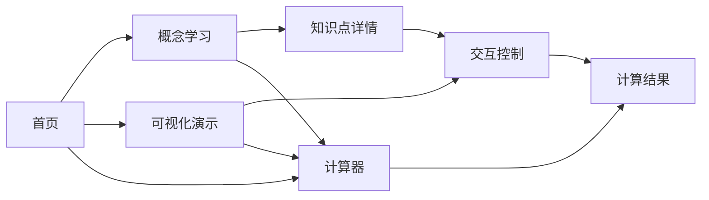

# 线性代数学习网站 - 产品需求文档 (PRD)

## 1. Product Overview

一个交互式的线性代数在线学习平台，帮助学生和爱好者系统学习矩阵运算、行列式、向量空间等核心概念。通过可视化演示和交互式计算器，让抽象的数学概念变得直观易懂。

- **主要目的**：提供一个美观、直观的线性代数学习工具
- **目标用户**：大学生、高中生、数学爱好者、科研人员
- **市场价值**：填补中文优质线性代数可视化教学资源的空白

## 2. Core Features

### 2.1 User Roles

| Role | Registration Method | Core Permissions |
|------|---------------------|------------------|
| 访客 | 无需注册 | 浏览所有内容，使用计算器和可视化工具 |

### 2.2 Feature Module

1. **首页**：导航栏、主题展示、功能模块快速入口
2. **概念学习**：矩阵、行列式、向量空间、线性变换等知识点讲解
3. **可视化演示**：矩阵变换动画、向量空间可视化
4. **计算器**：矩阵运算计算器（加法、乘法、逆矩阵、行列式等）
5. **练习题库**：练习题和答案解析

### 2.3 Page Details

| Page Name | Module Name | Feature description |
|-----------|-------------|---------------------|
| 首页 | 导航栏 | 固定顶部导航，Logo、菜单项、主题切换 |
| 首页 | 主题展示 | 大型渐变标题、数学符号装饰、引导动画 |
| 首页 | 功能卡片 | 四个主要功能模块的卡片展示 |
| 概念学习 | 侧边导航 | 知识点目录树，快速跳转 |
| 概念学习 | 内容区域 | 数学公式、示例代码、图表展示 |
| 可视化演示 | 控制面板 | 滑块、按钮控制动画参数 |
| 可视化演示 | Canvas 画布 | 实时渲染变换效果 |
| 计算器 | 输入区域 | 矩阵维度选择、数值输入 |
| 计算器 | 结果展示 | 计算结果、步骤解析 |

## 3. Core Process

用户访问首页 → 浏览功能模块 → 选择学习知识点或使用工具 → 交互式学习/计算 → 切换到其他功能

## 4. User Interface Design

### 4.1 Design Style

- **主题色系**：深海蓝 + 科技紫渐变（#1a1a2e → #16213e → #0f3460）
- **强调色**：霓虹绿（#00ff88）、电子蓝（#00bfff）
- **按钮风格**：圆角矩形，微凸起效果，悬停发光
- **字体**：
  - 标题：JetBrains Mono（等宽科技感字体）
  - 正文：Noto Sans SC（中文易读）
  - 数学公式：KaTeX/MathJax 渲染
- **布局风格**：卡片式布局，玻璃拟态（Glassmorphism）效果
- **图标风格**：Lucide 图标库，简洁线性风格

### 4.2 Page Design Overview

| Page Name | Module Name | UI Elements |
|-----------|-------------|-------------|
| 首页 | 主题展示 | 大型渐变标题、浮动数学符号、打字机效果、粒子背景 |
| 首页 | 功能卡片 | 四张卡片，玻璃效果，悬停放大，渐变色边框 |
| 概念学习 | 内容区域 | 深色背景，代码高亮，公式居中，卡片分隔 |
| 可视化演示 | Canvas区域 | 深色画布，霓虹线条，渐变网格 |
| 计算器 | 输入区域 | 矩阵网格输入，实时计算，步骤展示 |

### 4.3 Responsiveness

- **桌面优先**：1200px 以上最优显示
- **平板适配**：768px - 1200px，两列转单列
- **手机适配**：320px - 768px，单列布局，汉堡菜单
- **触摸优化**：按钮最小尺寸 44px，增加触控区域

### 4.4 视觉特色

- **玻璃拟态效果**：半透明卡片，模糊背景
- **渐变光晕**：模块边角的柔和发光
- **微交互动画**：悬停缩放、渐显渐隐、平滑滚动
- **数学符号装饰**：页面角落浮动的矩阵、行列式符号
