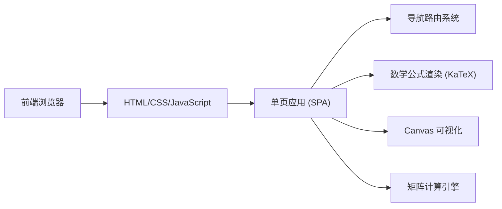

# 线性代数学习网站 - 技术架构文档

## 1. Architecture Design



## 2. Technology Description

- **前端技术栈**：纯 HTML5 + CSS3 + JavaScript ES6+
- **样式方案**：CSS3 变量 + Flexbox + Grid
- **动画方案**：CSS Animations + requestAnimationFrame
- **数学渲染**：KaTeX CDN（轻量级 LaTeX 渲染）
- **图标**：Lucide Icons CDN
- **打包方式**：无需构建工具，纯静态文件

**选择理由**：
- 纯静态文件，部署简单，无需后端
- 轻量级，加载速度快
- 数学公式渲染使用 KaTeX CDN
- Canvas 可视化直接操作 DOM

## 3. File Structure

```
linear-algebra/
├── index.html              # 主页面（单页应用入口）
├── css/
│   ├── style.css           # 全局样式
│   ├── pages/
│   │   ├── home.css        # 首页样式
│   │   ├── concepts.css    # 概念学习样式
│   │   ├── visualization.css # 可视化样式
│   │   └── calculator.css  # 计算器样式
│   └── components/
│       ├── navbar.css      # 导航栏样式
│       └── cards.css       # 卡片组件样式
├── js/
│   ├── main.js             # 主应用逻辑
│   ├── router.js           # 路由系统
│   ├── pages/
│   │   ├── home.js         # 首页逻辑
│   │   ├── concepts.js     # 概念学习内容
│   │   ├── visualization.js # 可视化逻辑
│   │   └── calculator.js   # 计算器逻辑
│   ├── utils/
│   │   ├── matrix.js       # 矩阵运算库
│   │   └── animation.js    # 动画工具
│   └── components/
│       └── navbar.js       # 导航栏组件
├── assets/
│   └── icons/              # 图标资源（如需要）
└── .trae/
    └── documents/
        ├── PRD.md
        └── TECHNICAL.md
```

## 4. Core Modules

### 4.1 路由系统

```javascript
// 简单的哈希路由实现
const routes = {
  '#/': renderHome,
  '#/concepts': renderConcepts,
  '#/visualization': renderVisualization,
  '#/calculator': renderCalculator
};
```

### 4.2 矩阵运算库

| 函数 | 功能 |
|------|------|
| `matrixAdd(A, B)` | 矩阵加法 |
| `matrixMultiply(A, B)` | 矩阵乘法 |
| `matrixTranspose(A)` | 矩阵转置 |
| `matrixDeterminant(A)` | 行列式计算 |
| `matrixInverse(A)` | 逆矩阵 |
| `matrixRank(A)` | 矩阵的秩 |

### 4.3 Canvas 可视化引擎

- 向量空间 2D/3D 渲染
- 线性变换动画
- 矩阵变换实时预览

## 5. 概念学习内容模块

### 5.1 知识点结构

```javascript
const concepts = [
  {
    id: 'matrix',
    title: '矩阵基础',
    content: [...],
    examples: [...]
  },
  {
    id: 'determinant',
    title: '行列式',
    content: [...],
    examples: [...]
  },
  {
    id: 'vector-space',
    title: '向量空间',
    content: [...],
    examples: [...]
  },
  {
    id: 'linear-transformation',
    title: '线性变换',
    content: [...],
    examples: [...]
  },
  {
    id: 'eigenvalue',
    title: '特征值与特征向量',
    content: [...],
    examples: [...]
  }
];
```

## 6. 外部依赖

| 资源 | 用途 | CDN 地址 |
|------|------|----------|
| KaTeX | 数学公式渲染 | `https://cdn.jsdelivr.net/npm/katex@0.16.9/dist/` |
| Lucide Icons | 图标库 | `https://unpkg.com/lucide@latest/dist/umd/lucide.js` |
| JetBrains Mono | 等宽字体 | Google Fonts CDN |
| Noto Sans SC | 中文字体 | Google Fonts CDN |

## 7. 性能优化

- **按需加载**：页面内容懒加载
- **缓存策略**：静态资源浏览器缓存
- **Canvas 优化**：requestAnimationFrame 控制渲染帧率
- **字体预加载**：关键字体 preload

## 8. 浏览器兼容性

| 浏览器 | 版本支持 |
|--------|----------|
| Chrome | 80+ |
| Firefox | 75+ |
| Safari | 13+ |
| Edge | 80+ |

**特性依赖**：
- Canvas API
- CSS Grid / Flexbox
- ES6+ 语法
- CSS Variables
